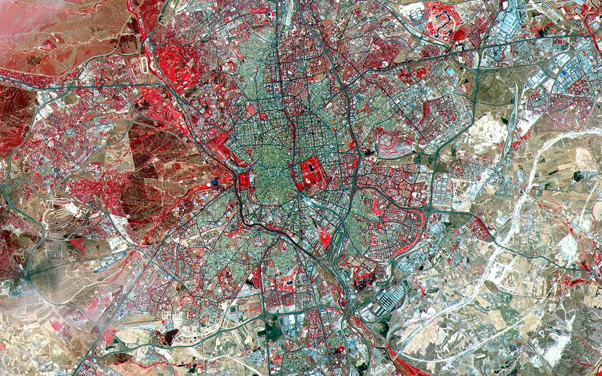
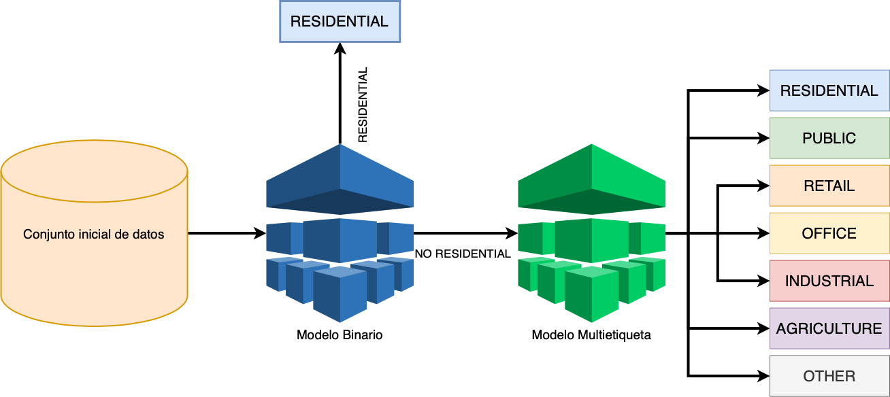

# Reto Minsait Land Classification

## UniversityHack2020 - Equipo: CMBC

## Tabla de contenidos

 1. [Introducción](#introduccion)
 2. [Tecnología necesaria para la realización de este proyecto](#tecnologia)
 3. [Breve resumen del trabajo desarrollado](#resumen)
 4. [Análisis exploratorio y manipulación de variables](#analisis-exploratorio)
 	* [Variables numéricas](#variables-numericas)
 		* [Geoposición](#geoposicion)
 		* [Color](#color)
 		* [Geometría](#geometria)
 		* [Otras](#otras)
 	* [Variables discretas](#variables-discretas)
 5. [Construcción y justificación selección de los modelos](#seleccion-modelos)
 6. [Conclusiones](#conclusion)

## 1. Introducción

Este proyecto fundamenta la propuesta ideada por el equipo **CMBC** para el reto de [UniversityHack 2020 DATATHON](https://www.cajamardatalab.com/datathon-cajamar-universityhack-2020/)

El equipo está compuesto por:

* [Cristian Cifuentes García](https://www.linkedin.com/in/cifucg)
* [Manuel Bermúdez Martínez](https://www.linkedin.com/in/manuelbermudezmartinez)

El objetivo del reto **Minsait Land Classification** consiste en maximizar la _exactitud_, que se define como el _número de registros correctamente clasificados / número total de registros proporcionados por la Organización_, tal y como se indica en la propia página oficial.

Para ello se cuenta con dos ficheros, los cuales contienen un listado de superficies sobre las que se han recortado la imagen del satélite Sentinel II del servicio Copernicus de la Agencia Espacial Europea y se han extraído una serie de características de sus geometrías, posición, colores, etc. Y finalmente, se ha etiquetado el conjunto de los datos según la clasificación de suelo.

Se cuenta con un fichero para realizar el análisis y la generación de los algoritmos de clasificación empleados, denominado _Estimar.txt_ y también con un segundo fichero, el cual se utilizará para realizar la entrega a la organzación. Este segundo fichero contiene una serie de registros con las mismas variables pero sin la etiqueta que clasifique el suelo.

## 2. Tecnología necesaria para la realización de este proyecto
* [Python](https://www.python.org)
* [Jupyter notebook](https://jupyter.org)
* [scikit-learn](https://scikit-learn.org/stable/index.html)
* [Pandas](https://pandas.pydata.org)
* [XGBoost](https://xgboost.readthedocs.io/en/latest/)

## 3. Breve resumen del trabajo desarrollado

Con el fin de cumplir el principal objetivo del reto, se ha realizado un extenso análisis previo para comprenter y aprender lo máximo posible acerda de las imágenes extraidas por el satélite Sentinel II del servicio Copernicus de la Agencia Espacial Europea, ya que la mayoría de las variables del conjunto de datos pertenecen a la misma. Además, se ha comprobado la importancia de cada una de estas variables en función de nuestro propósito.

Después de revisar toda la información posible y de un análisis exploratorio, el cual se comenta en el siguiente apartado, se ha construido un conjunto de datos en función de los problemas que han ido surgiendo (valores atípicos, valores perdidos, etc). Una vez estudiado el conjunto de datos, se ha continuado con una estrategia de apilamiento de modelos, es decir, se ha desarrollado un apartado comparando diversos modelos binarios para finalmente, seleccionar aquel que ofrezca un resultado más preciso y robusto. Posteriormente se ha desarrollado un modelo multietiqueta mediante el resultado obtenido en el primer modelo.

En todos y cada uno de estos modelos se ha realizado un intenso estudio de los hiperparámetros, regresores, parámetros y distintos conjuntos de entrenamiento y validación mediante técnicas como la validación cruzada. Finalmente se han comprobado los resultados con un conjunto de validación previamente definido, el cual no se ha utilizado en ninguna otra fase del proyecto.

## 4. Análisis exploratorio y manipulación de variables

El principal problema de este reto es el desbalanceo que existe en el conjunto de datos proporcionado por la Organización, por lo tanto, para intentar reducir o comprender los registros y las variables, se ha realizado un profundo análisis del mismo y previamente de los aspectos que pudiesen favorecer la tarea del mismo.

Primeramente y tras comprobar el total de registros que presenta cada una de las diferentes etiquetas de la variable objetivo se ha llevado a cabo una división en función del tipo de cada una de las variables, dando como resultado una lista de variables numéricas y otra de variables categóricas. El análisis de las mismas se ha realizado de forma independiente ya que cada tipo requiere una tratamiento distinto.

### Variables numéricas

Para las variables numéricas se ejecutado otra separación en función de la información que aporta cada una de las variables, produciendo así cuatro grupos distintos: geoposición, color, geometría y otras.

#### Geoposición
Estas variables, como ya sabemos gracias a la información proporcionada por la Organización, han sido escaladas y desplazadas aleatoriamente, manteniendo la relación con el resto de registros. Aún así, analizando de forma gráfica este tipo de variables hemos podido comprobar que la mayor parte de los registros están situados de forma uniforme en un mapa y que adémás, no existe una distinción por zonas ya que podemos encontrar terreno de cualquier tipo cerca de otro, aunque bien es cierto que en ciertos casos esto se produce con muy poca frecuencia. Por ejemplo, etiquetas como `Agriculture` o `Industrial` están situadas en las afueras del lo que sería el centro de la imagen tomada como referencia.

#### Color
En cuanto a las variables correspondientes al color de la imagen sabemos que, después de leer información sobre este tipo de satélite, se ha extraído información de 4 canales (R, G, B y NIR), correspondientes a las bandas de color rojo, verde y azul, y el infrarrojo cercano. El valor mostrado en cada una de estas variables corresponde a la intensidad por deciles en cada imagen.

La banda de color **rojo corresponde a la banda 4 del espectro visible**, el **verde a la banda 3** y el **azul a la banda 2**, mientras que el **infrarrojo cercano hace referencia a la banda 8** del espectro electromagnético. Dichas bandas junto con el valor de su longitud de onda central se puede observar en la imagen adjunta. Además, todas ellas presentan una resolución de **10m/px**.

De primeras podemos pensar que al ser variables relacionadas con la intensidad del color, se podría obtener un histograma del mismo pero se ha comprobado que la suma total de los mismos no es idéntica y por lo tanto, se ha descartado la posibilidad de representar un histograma. Junto a esto, se ha observado que para todos los registros el valor de los deciles aumenta progresivamente, presentando unos valores elevados en el último decil y valores cercanos a 0 en el menor de los deciles.

Durante este análisis se ha realizado una **reducción de la dimensionalidad** de estas variables, mediante PCA, con el fin de seleccionar las características más influyentes para nuestro modelo y hemos comprobado que no obtenemos los resultados esperados, por lo que se ha terminado por descartar esta metodología. Además, se ha podido comprobar que cada una de estas variables presenta una correlación muy elevado con el decil anterior y posterior al mismo.

#### Geometría
Otro de los aspectos importantes de cara a la clasificación del terreno son las variables geométricas, por ello mismo hemos llevado a cabo un estudio en profundidad de las mismas y una comparación con el resto de variables, independientemente del tipo que presente. Con ello se ha llegado a la conclusión, como era de esperar, que el área más elevada se presenta en etiquetas como `Agriculture`, `Retail` y `Other`.

Asimismo se han estudiado todos los valores de estas variables ya que presentan _outliers_, dando como resultado la eliminación de los mismos para comprobar el conjunto de datos resultante, el cual ha disminuido notablemente el número de registros. A consecuencia de ello, se ha comprobado que no todos ellos son valores atípicos y por lo tanto, no se ha realizado una eliminación sobre el conjunto de datos final.

#### Otras
Este grupo de variables es el más reducido y además, aportan información sobre los edificios o terrenos colindantes y no sobre el cual se pretende realizar una clasificación. Aún así, en el estudio de estas dos variables se ha visto que presentan valores perdidos, los cuales se han tratado en un _Pipeline_.

### Variables discretas
Este conjunto de variables es reducido en comparación con las variables numéricas. Para este caso no he hecho falta realizar ninguna subdivisión de las variables y en el estudio de las mismas se implementado una función que permita posteriormente preprocesar la variable realacionada a la calidad del catastro.

Junto a este implementación se ha demostrado que la mayor parte de los terrenos del conjunto de datos pertenecen a una calidad media del catastro, situandose en los valores intermedios del rango establecido.

## 5. Construcción y justificación selección de los modelos

Como se ha comentado al inicio, se han desarrollado diversos modelos con el fin de buscar una diversidad entre los mismos y seleccionar aquel que ofrezca unos resultados más precisos y robustos. Además, cabe destacar que se ha realizado una técnica, la cual consiste en el **apilamiento de modelos**, es decir, primeramente se ha seleccionado y entrenado un modelo binario y posteriormente, con los resultados obtenidos se ha desarrollado un modelo multietiqueta. 

Para poder trabajar correctamente, en este apartado se han utilizado elementos como _Pipelines_ y _ColumTransform_ con el fin de poder obtener un conjunto de datos óptimo para el entrenamiento de los modelos necesarios. En estos _Pipelines_ se realiza una normalización de los valores de cada una de las variables, un **over-sampling** mediante la técnica de _SMOTE_ con el fin de balancear el conjunto de datos y por último, se realizan una serie de funciones previamente implementadas.

En el primero de ellos, el modelo binario, se ha buscado maximizar los hiperparámetros usando siempre el sentido común. Para conseguir esto se ha hecho uso de técnicas de validación cruzada y _GridSearchCV_. El resultado de este procedimiento fue la obtención de dos modelos robustos en función de la métrica establecida, _f1-score_, un **Random Forest** y un **XGBoost**.

En el segundo de ellos, el modelo multietiqueta, de igual forma se han buscado maximizar los hiperparámetros pero debido a la complejidad del problema y al elevado número de registros se ha optado por un **Random Forest** el cual ha mostrado siempre resultados más que decentes y robustos en todas las pruebas realizadas. Este modelo cuenta con todas las etiquetas de la variable a predecir ya que clasificará en función de los datos de salida que genere el modelo binario. Como se espera que el modelo binario presente una tasa de fallos se mantiene la etiqueta  `Residential` en este modelo multietiqueta para reducir el error del primer modelo.

Un esquema muy sencillo de la estrategia utilizada es el mostrado a continuación:

## 6. Conclusiones

Una vez se ha realizado la estrategia anteriormente comentada, se ha generado una tabla con los resultados obtenidos en el entrenamiento de cada uno de los algoritmos de clasificación para el modelo binario, la cual se muestra a continuación:

> :warning: **Estos tiempos dependen principalmente del ordenador utilizado para el entrenamiento de los modelos**

<table class="table table-hover">
    <thead>
        <tr> <th>Modelo</th> <th>Tiempo (min)</th> <th>F1 score</th><th>Parámetros</th></tr> 
    </thead>
    <tbody>
        <tr> <td>SGD</td> <td>0.396</td> <td>0.911</td> <td>max_iter: 100, tol: 0.0001</td> </tr>
        <tr> <td>Logistic regression</td> <td>0.901</td> <td>0.75</td> <td>C: 0.250075, tol: 0.001</td> </tr>
        <tr> <td>Decision tree</td> <td>0.278</td> <td>0.929</td> <td>max_depth: 10</td> </tr>
        <tr> <td>Random forest</td> <td>3.15</td> <td>0.951</td> <td>max_depth: 20, n_estimators: 200</td> </tr>
        <tr> <td>XGBoost</td> <td>12.023</td> <td>0.96</td> <td>max_depth: 10, n_estimators: 200</td> </tr>
    </tbody>
</table>

Como se puede comprobar, el **Random Forest** y el **XGBoost** no presentan una gran diferencia, pero a fin de obtener el más robusto se ha optado por el segundo. Tras aplicar el segundo modelo, el multietiqueta, al conjunto de validación previamente definido, los resultados obtenidos son:

<table class="table table-hover">
    <thead>
        <tr> <th>Modelo</th> <th>Tiempo (min)</th> <th>F1 score</th><th>Parámetros</th></tr> 
    </thead>
    <tbody>
        <tr> <td>SGD</td> <td>0.396</td> <td>0.911</td> <td>max_iter: 100, tol: 0.0001</td> </tr>
        <tr> <td>Logistic regression</td> <td>0.901</td> <td>0.75</td> <td>C: 0.250075, tol: 0.001</td> </tr>
        <tr> <td>Decision tree</td> <td>0.278</td> <td>0.929</td> <td>max_depth: 10</td> </tr>
        <tr> <td>Random forest</td> <td>3.15</td> <td>0.951</td> <td>max_depth: 20, n_estimators: 200</td> </tr>
        <tr> <td>XGBoost</td> <td>12.023</td> <td>0.96</td> <td>max_depth: 10, n_estimators: 200</td> </tr>
    </tbody>
</table>
